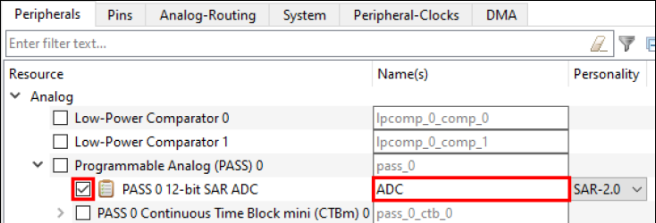
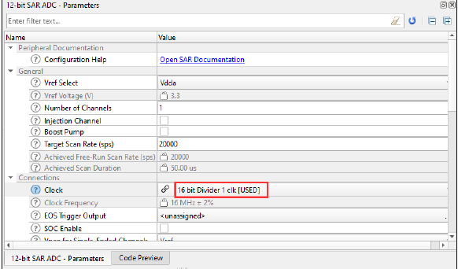
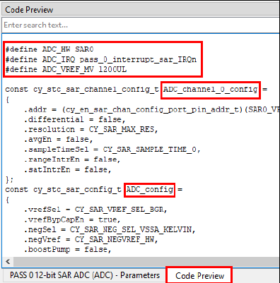

# ADC

## Device configurator

Go to **Peripherals tab**.Then, in the drop-down menu, select Analog > Programmable Analog. Then check the box on the 12-bit SAR ADC to enable it:


Then on the right side of the screen you can configure the ADC how you want. One parameter you need to change is Clock:

You also need to select how many channels you want and specify which pin(s) each channel connects to. The pins themselves should be configured with the drive mode Analog High-Z, Input buffer off.

Code preview: 


In the example shown above, the reference is selected as Vdda. If you instead chose the internal reference, you will need to enable that reference in the configurator and start it in the code using Cy_SysAnalog_Init and Cy_SysAnalogEnable.
## Main

In your application code you need to call the function Cy_SAR_Init to initialize your ADC. The Device Configurator generated a macro for the first argument to this function, by default this is called \<ADC_Name>\_HW, where \<ADC_Name> is the name of your ADC from earlier. The second argument to this function is a pointer to the configuration structure that the Device Configurator generated. By default, this structure is called \<ADC_Name>\_config. 

Then you need to call the function Cy_SAR_Enable to enable your ADC.

```C
/* Initialize and enable the ADC */
Cy_SAR_Init(ADC_HW, &ADC_config);
Cy_SAR_Enable(ADC_HW);
```

Code example: 
```C
int32_t ADCresult = 0; /* ADC conversion result in counts */
int32_t microVolts = 0; /* ADC conversion result in microVolts */
/* Initialize and enable the ADC */
Cy_SAR_Init(ADC_HW, &ADC_config);
Cy_SAR_Enable(ADC_HW);
/* Start a single conversion */
Cy_SAR_StartConvert(ADC_HW, CY_SAR_START_CONVERT_SINGLE_SHOT);
/* Wait for the ADC to finish and then get the result */
if(Cy_SAR_IsEndConversion(ADC_HW, CY_SAR_WAIT_FOR_RESULT) == CY_SAR_SUCCESS)
{
ADCresult = Cy_SAR_GetResult32(ADC_HW, 0);
microVolts = Cy_SAR_CountsTo_uVolts(ADC_HW, 0, ADCresult);
}
```

