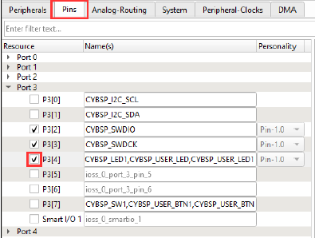

GPIO

## Device configurator
To initialize a GPIO using the PDL, open the Device Configurator and go to the Pins tab. From here you can
enable a pin simply by checking its box:

Configure the pin how you want, then do File > Save, and exit the device configurator.
All that's left for you to do now is to read from or write to the pin! Any pins you set up in the Device
Configurator will automatically be initialized when you call cybsp_init. The PDL provides several functions
for reading from and writing to pins, some commonly used ones are:
• Cy_GPIO_Read
• Cy_GPIO_Write
• Cy_GPIO_Set
• Cy_GPIO_Clr
• Cy_GPIO_Inv
For example, the following will toggle the state of an output pin:
Cy_GPIO_Inv(CYBSP_USER_LED_PORT, CYBSP_USER_LED_NUM);
If you want to change what a GPIO is used for, for example say you were using it to read input from a button,
but now you want to drive it with a PWM, it is important to properly reconfigure the pin to do so. If you are
using the PDL, you should use the function Cy_GPIO_Pin_Init for this.