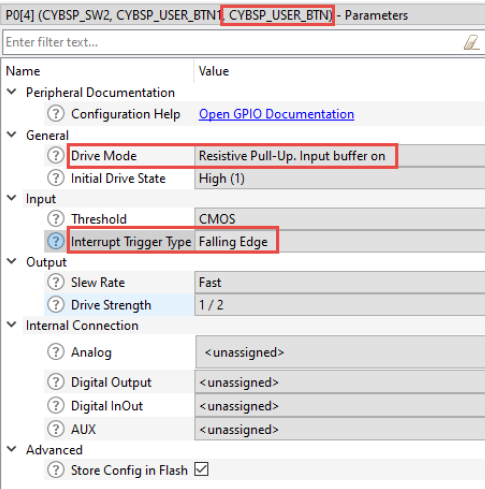

# Interrupt using PDL

## Device configurator

The Device Configurator was used to configure the pin and its interrupts and its name is specified as CYBSP_USER_BTN as shown here:


## Main 


```C
#define GPIO_INTERRUPT_PRIORITY (7u)
#define PORT_INTR_MASK (0x00000001UL << CYBSP_USER_BTN_PORT_NUM)
/* Interrupt callback function */
void GPIO_Interrupt_Handler(void){
/* Get interrupt cause */
uint32_t intrSrc = Cy_GPIO_GetInterruptCause0();
/* Check if the interrupt was from the user button's port */
if(PORT_INTR_MASK == (intrSrc & PORT_INTR_MASK)){
/* Clear the interrupt */
Cy_GPIO_ClearInterrupt(CYBSP_USER_BTN_PORT, CYBSP_USER_BTN_NUM);
/* Place any additional interrupt code here */
}
}
int main(void)
{
/* Initialize the device and board peripherals */
cybsp_init() ;
/* Enable global interrupts */
__enable_irq();
	/* Interrupt config structure */
	cy_stc_sysint_t intrCfg =
	{
	/*.intrSrc =*/ CYBSP_USER_BTN_IRQ,
	/*.intrPriority =*/ GPIO_INTERRUPT_PRIORITY
	};
/* Initialize the interrupt and register interrupt callback */
Cy_SysInt_Init(&intrCfg, &GPIO_Interrupt_Handler);
/* Enable the interrupt in the NVIC */
NVIC_EnableIRQ(intrCfg.intrSrc);
for (;;)
{
/* Place main application code here */
}
}
```


