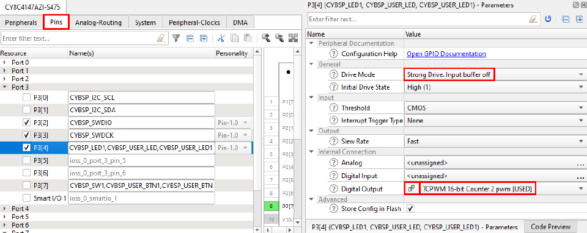
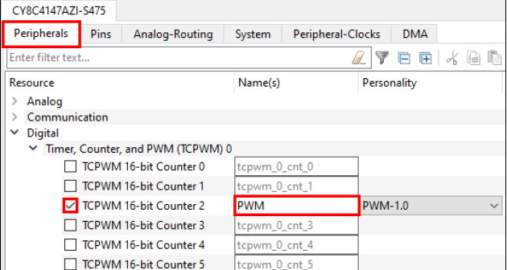

# PWM -TCPWM

## Device configurator

First you should select a pin which output you want for the TCPWM. Then under **Digital output**, choose the option ending in **PWM** or **PWM_n**. You may either select 16-bit or 32-bit TCPWM. 


Then click on the "link" button that appears in the Digital Output parameter.
This will take you to Peripherals tab for the TCPWM you selected. Enable the counter you need by checking its
box (it will appear with a clip-board next to its name), select PWM-\<version\> from the popup and click OK. 


The most important parameter is the **clock signal**.
Then do File > Save, and exit the Device Configurator.

## Main
In your application code you need to call the function Cy_TCPWM_PWM_Init to initialize your PWM. The Device Configurator generates macros that can be used for the first two arguments to this function. By default, these are called <PWM_Name>_HW and <PWM_Name>_NUM, where <PWM_Name> is the name of your PWM from earlier. The third argument to this function is a pointer to the configuration structure that the Device Configurator generated. By default, this structure is called <PWM_Name>_config.

Then you need to call the function Cy_TCPWM_PWM_Enable to enable your PWM. To start the PWM call the function Cy_TCPWM_TriggerReloadOrIndex_Single. To stop the PWM, call the Cy_TCPWM_TriggerStopOrKill function. The following example will initialize and start a PWM that was setup using the Device Configurator and which was named "PWM".

```c
Cy_TCPWM_PWM_Init(PWM_HW, PWM_NUM, &PWM_config);
Cy_TCPWM_PWM_Enable(PWM_HW, PWM_NUM);
Cy_TCPWM_TriggerReloadOrIndex_Single(PWM_HW, PWM_NUM);
```


