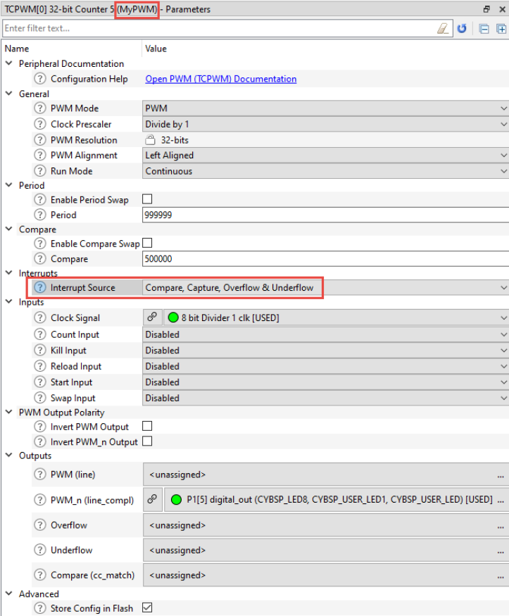

# PWM interrupt

## Device configurator
The following code snippet shows a PDL PWM interrupt for any event (Compare, Capture, Overflow & Underflow). In this case, the interrupt callback function checks the event that caused the interrupt to decide what to do.

The Device Configurator was used to configure the PWM and the associated pin and clock correctly and that the PWM's name is specified as MyPWM. In addition, the Device Configurator was used to enable interrupts on the desired PWM events as shown here:


## Main 

```c
#define PWM_INTERRUPT_PRIORITY (7u)
/* Interrupt callback function */
void PWM_Interrupt_Handler(void){
/* Get interrupt cause */
uint32_t intrSrc = Cy_TCPWM_GetInterruptStatus(MyPWM_HW, MyPWM_NUM);
	if((intrSrc & CY_TCPWM_INT_ON_CC0) == CY_TCPWM_INT_ON_CC0)
	{
	/* Compare event triggered */
	/* Insert application code to handle event */
	}
	else if((intrSrc & CY_TCPWM_INT_ON_TC) == CY_TCPWM_INT_ON_TC)
	{
	/* Terminal count event triggered */
	/* Insert application code to handle event */
	}
/* Clear all interrupt sources */
Cy_TCPWM_ClearInterrupt(MyPWM_HW, MyPWM_NUM, intrSrc);
}
int main(void)
{
	/* Initialize the device and board peripherals */
	cybsp_init() ;
	/* Enable global interrupts */
	__enable_irq();
	/* Interrupt config structure */
	cy_stc_sysint_t intrCfg =
	{
	/*.intrSrc =*/ MyPWM_IRQ,
	/*.intrPriority =*/ PWM_INTERRUPT_PRIORITY
	};
	/* Initialize the interrupt and register interrupt callback */
	Cy_SysInt_Init(&intrCfg, &PWM_Interrupt_Handler);
	/* Enable the interrupt in the NVIC */
	NVIC_EnableIRQ(intrCfg.intrSrc);
	/* Initialize the TCPWM block */
	Cy_TCPWM_PWM_Init(MyPWM_HW, MyPWM_NUM, &MyPWM_config);
	/* Enable the TCPWM block */
	Cy_TCPWM_PWM_Enable(MyPWM_HW, MyPWM_NUM);
	/* Start the PWM */
	Cy_TCPWM_TriggerReloadOrIndex_Single(MyPWM_HW, MyPWM_NUM);
for (;;)
{
/* Place main application code here */
}
}
```
