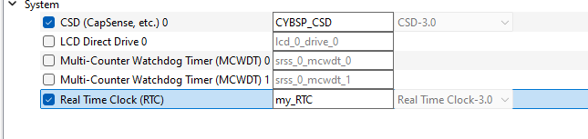
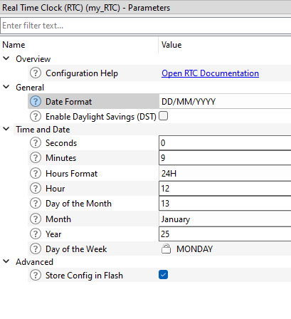

# RTC for PDL

## hyperlink to PDL website
[RTC_PDL](file:///C:/MTW/MTB_SmartDevices/mtb_shared/mtb-pdl-cat1/release-v3.12.1/docs/pdl_api_reference_manual/html/group__group__rtc.html)


## Device configurator 





## Main 

To initialize the RTC in your application, use the following function:
```C
Cy_RTC_Init(&<name-from-device-cofigurator>_config); 
// init an struct for the timer could be global or defined
cy_stc_rtc_config_t current_time;
```
Define a structure to store the timer's current date and time. This structure can be global or local:
```c
cy_stc_rtc_config_t current_time;
```
### Using RTC Functions

You can retrieve and manipulate the RTC date and time using functions like:
```c
Cy_RTC_GetDateAndTime(&current_time);
```

### Formatting Time for Printing

To convert the retrieved time into a readable format for UART output, use the following:
```c
snprintf(buffer, sizeof(buffer),
    	                 "Current Time: %02lu:%02lu:%02lu, Date: %02lu/%02lu/%04lu\r\n",
    	                 current_time.hour, current_time.min, current_time.sec,
    	                 current_time.date, current_time.month, 
    	                 current_time.year+ 2000);
```
### Example Output

When printed via UART, the output can look like this:
```
Current Time: 12:56:10, Date: 13/01/2025
Current Time: 12:56:11, Date: 13/01/2025
Current Time: 12:56:12, Date: 13/01/2025
Current Time: 12:56:13, Date: 13/01/2025
Current Time: 12:56:14, Date: 13/01/2025
Current Time: 12:56:15, Date: 13/01/2025
Current Time: 12:56:15, Date: 13/01/2025
Current Time: 12:56:16, Date: 13/01/2025
Current Time: 12:56:17, Date: 13/01/2025
Current Time: 12:56:18, Date: 13/01/2025
```
